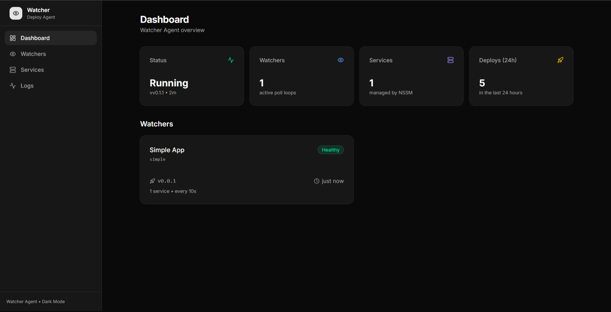
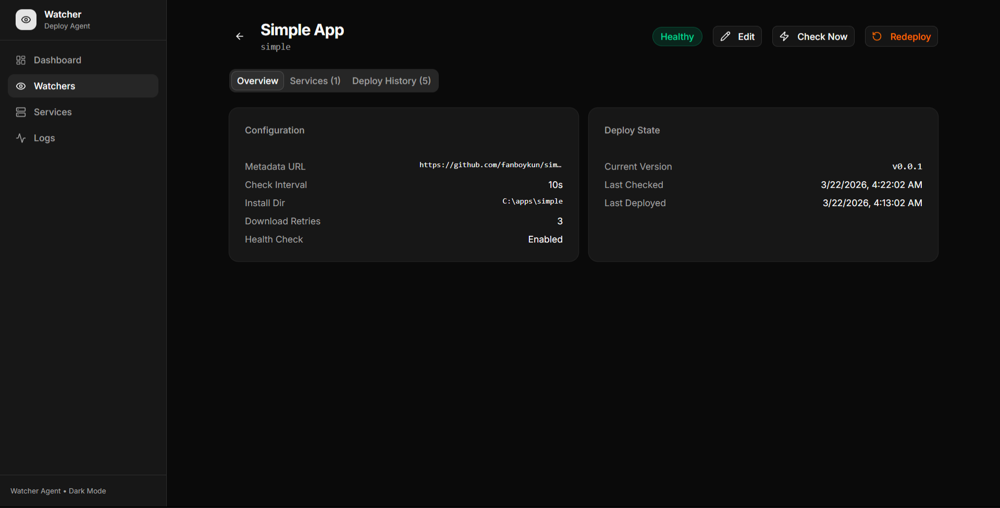
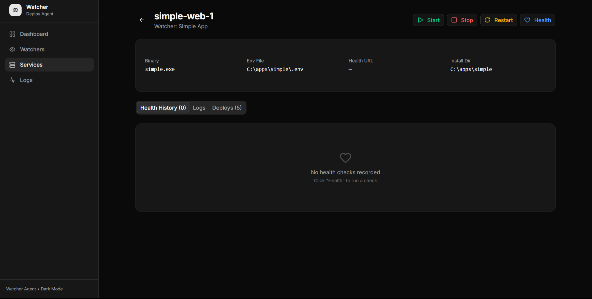

# Watcher Agent

[](https://go.dev/)
[](https://opensource.org/licenses/MIT)
[](http://makeapullrequest.com)

A pull-based deployment agent for Go services on private Windows servers with no inbound network access.

The watcher runs as a Windows service, polls GitHub Releases on a configurable interval, and deploys new versions automatically — no SSH, no VPN, no push access required. Includes a built-in web dashboard for managing watchers, services, and viewing deploy history.

---

## Table of contents

- [Features](#features)
- [Screenshots](#screenshots)
- [How it works](#how-it-works)
- [Requirements for watched services](#requirements-for-watched-services)
- [Project structure](#project-structure)
- [Installation](#installation)
- [Dashboard](#dashboard)
- [Rollback](#rollback)
- [Disk layout](#disk-layout)
- [Configuration reference](#configuration-reference)
- [Development & Contributing](#development--contributing)

---

## Features

- **Pull-based deployment** — polls GitHub Releases over HTTPS, no inbound access required
- **Multi-watcher** — watch multiple repos from a single agent
- **Dual service support** — manages both NSSM background binaries and IIS static sites
- **Health checks** — validates deploys with HTTP health endpoints, auto-rollbacks on failure
- **Web dashboard** — embedded SvelteKit SPA served from the single binary
- **REST API** — full API for managing watchers, services, deploys, and logs
- **SQLite database** — stores watchers, services, deploy history, and health events
- **Single binary** — one `.exe` file contains the agent, API server, and dashboard
- **Zero-downtime swap** — uses NTFS junctions (`mklink /J`) for atomic directory switching

---

## Screenshots







---

## Requirements for watched services

> **Any service managed by this watcher must use the same `release.yml` workflow.**

The watcher is tightly coupled to the release format that `release.yml` produces. If a service repo uses a different release workflow or a different artifact structure, the watcher will fail to deploy it.

### What `release.yml` must produce

Every watched service repo must publish a GitHub Release containing exactly these two assets:

**1. `version.json`** — the version metadata file the watcher polls:

```json
{
  "services": {
    "<APP_NAME>": {
      "version": "v1.2.0",
      "artifact": "my-service-v1.2.0.zip",
      "artifact_url": "https://github.com/your-org/my-service/releases/download/v1.2.0/my-service-v1.2.0.zip",
      "published_at": "2024-01-15T10:00:00Z"
    }
  }
}
```

**2. `<APP_NAME>-<version>.zip`** — a flat zip archive containing the binaries:

```
my-service-v1.2.0.zip
  ├── web.exe       ← at root level, no subdirectory
  └── worker.exe    ← at root level, no subdirectory
```

> Binaries **must be at the root** of the zip. The watcher extracts directly into `releases/<version>/` and expects `releases/<version>/web.exe` — not `releases/<version>/dist/web.exe`.

### How to set up `release.yml` in a new service repo

1. Copy `workflows/release.yml` from this repo into `.github/workflows/release.yml` of the target service repo
2. Edit only the config block at the top of the file
3. Add the same secrets to the repo's `production` environment

### The contract between `release.yml` and the watcher database

These values must stay in sync between the service repo's `release.yml` and the watcher's configuration (managed via the dashboard or API):

| `release.yml`   | Watcher config              | Must match                                             |
| --------------- | --------------------------- | ------------------------------------------------------ |
| `APP_NAME`      | Watcher `service_name`      | Exact string match — this is the key in `version.json` |
| `WEB_BINARY`    | Service `binary_name`       | Exact filename inside the zip                          |
| `WORKER_BINARY` | Service `binary_name`       | Exact filename inside the zip                          |

---

## How it works

```
Developer
  └── git push origin main
        ↓
GitHub Actions (release.yml in app repo)
  └── auto-tags + builds + creates GitHub Release
  └── uploads artifact.zip + version.json
        ↓  (HTTPS poll)
Watcher Agent  [Windows Service]
  └── polls version.json → detects new version
  └── downloads artifact zip
  └── extracts to releases/<version>/
  └── stops services (if NSSM binary)
  └── swaps current/ junction → new release
  └── starts services / recycles app pools (if IIS static)
  └── health check → rollback on failure
  └── records deploy in SQLite database
        ↓
Dashboard  [http://localhost:8080]
  └── view deploy status, history, service health
  └── manage watchers and services
  └── trigger immediate checks
  └── start/stop/restart services
```

---

## Project structure

```
watcher/
  cmd/watcher/main.go             entrypoint — signal handling, starts Agent + API server
  internal/
    agent/
      watcher.go                   Agent + RepoWatcher — one goroutine per watched repo
      deploy.go                    extract zip, swap junction, NSSM management, rollback
      github.go                    fetch version.json, download artifact (public/private)
      github_test.go               httptest-based tests for GitHubClient
      state.go                     deploy state tracking via SQLite
      logger.go                    structured JSON logger with per-component context
      ticker.go                    ticker helper
    api/
      router.go                    Gin router — API routes + embedded SPA serving
      handlers.go                  watcher CRUD handlers
      service_handlers.go          service management handlers (start/stop/restart/health)
      system_handlers.go           system status + log tail endpoints
      dto.go                       request/response DTOs
    config/
      config.go                    LoadConfig() from .env file
    database/
      database.go                  SQLite via GORM (pure-Go driver, no CGO)
      models.go                    Watcher, Service, DeployLog, HealthEvent models
  web/
    embed.go                       go:embed directive for the SPA
    build/                         SvelteKit build output (embedded into binary)
    src/                           SvelteKit source
    package.json                   SvelteKit + Tailwind + shadcn-svelte
  shell/
    install-watcher.ps1            bootstrap script — installs Chocolatey, NSSM, registers service
  workflows/
    release.yml                    template release workflow for watched app repos
  .github/workflows/
    release.yml                    this repo's release workflow (builds SPA + Go binary)
  .env.example                     example config
  Makefile                         build, test, dev targets
```

---

## Installation

For step-by-step instructions, see **[INSTALL.md](./INSTALL.md)**.

Quick start:

```powershell
# On Windows, as Administrator:
# 1. Copy watcher.exe + shell/ to C:\apps\watcher\
# 2. Run the bootstrap script:
Set-ExecutionPolicy Bypass -Scope Process -Force; .\shell\install-watcher.ps1
# 3. Follow the interactive menu to select desired features (NSSM, IIS, ARR)
# 4. Open http://localhost:8080
```

The install script presents an interactive menu to safely install Chocolatey, NSSM, IIS features, and ARR depending on your deployment needs. It also handles `.env` creation, registration, and startup automatically.

---

## Dashboard

The web dashboard is embedded in the binary and served at `http://localhost:<API_PORT>` (default: 8080).

### Pages

- **Dashboard** — system overview with watcher status cards
- **Watchers** — list, add, edit, delete watchers; trigger immediate checks
- **Watcher Detail** — configuration, deploy state, services list, deploy history
- **Services** — list all services with start/stop/restart/health actions
- **Service Detail** — health history, log viewer (stdout/stderr), deploy history
- **Logs** — agent log viewer

### REST API

All dashboard operations are available via the REST API at `/api/*`:

| Method   | Endpoint                          | Description                |
|----------|-----------------------------------|----------------------------|
| `GET`    | `/api/status`                     | System status              |
| `GET`    | `/api/logs`                       | Agent log tail             |
| `GET`    | `/api/watchers`                   | List watchers              |
| `POST`   | `/api/watchers`                   | Create watcher             |
| `GET`    | `/api/watchers/:id`               | Get watcher detail         |
| `PUT`    | `/api/watchers/:id`               | Update watcher             |
| `DELETE` | `/api/watchers/:id`               | Delete watcher             |
| `POST`   | `/api/watchers/:id/check`         | Trigger immediate check    |
| `GET`    | `/api/watchers/:id/deploys`       | Watcher deploy history     |
| `GET`    | `/api/watchers/:id/services`      | List watcher's services    |
| `POST`   | `/api/watchers/:id/services`      | Add service to watcher     |
| `GET`    | `/api/services`                   | List all services          |
| `GET`    | `/api/services/:id`               | Service detail             |
| `POST`   | `/api/services/:id/start`         | Start service (NSSM)       |
| `POST`   | `/api/services/:id/stop`          | Stop service (NSSM)        |
| `POST`   | `/api/services/:id/restart`       | Restart service (NSSM)     |
| `GET`    | `/api/services/:id/health`        | Run health check           |
| `GET`    | `/api/services/:id/health/history`| Health check history       |
| `GET`    | `/api/services/:id/logs`          | Service log tail           |
| `GET`    | `/api/services/:id/deploys`       | Service deploy history     |

---

## Development & Contributing

### Prerequisites

- Go 1.21+
- Bun (for SvelteKit)
- Air (auto-installed by `make dev`)

### Dev workflow

Run the Go backend and SvelteKit dev server in two terminals:

```bash
# Terminal 1: Go backend with hot reload
make dev

# Terminal 2: SvelteKit dev server (with API proxy to :8080)
cd web && bun run dev
```

### Build targets

```bash
make build         # Build SPA + cross-compile watcher.exe for Windows
make build-web     # Build SvelteKit SPA only
make test          # Run all Go tests
make test-verbose  # Run tests with -v
make test-github   # Run only GitHub client tests
make dev           # Start Air hot-reload for Go backend
make package       # Build + zip for distribution
make clean         # Remove bin/ and web/build/
make info          # Print Go environment
make help          # Show all targets
```

### Releasing the Watcher (Internal)

The watcher uses **auto-tagging via semantic versioning**. Push a commit to `main` with a recognized pattern:

#### Commit patterns

| Pattern                                 | Bump     |
| --------------------------------------- | -------- |
| `feat: <msg>`                           | minor    |
| `fix: / perf: / refactor: <msg>`        | patch    |
| `feat!: <msg>` / `BREAKING CHANGE`      | major    |
| `chore: / docs: / ci: / test:`          | skip     |
| `minor: / patch: / major: <msg>`        | respective |
| `bump: minor / patch / major`           | respective |
| `release: <msg>` / `[release]`          | patch    |

**Fallback**: If only skip-pattern commits exist but important files changed (code, workflows, config), the workflow defaults to a **patch** bump.

#### Manual trigger

**Actions → Release Watcher → Run workflow** → set `force_bump` to `patch`, `minor`, or `major`.

#### Skip release

Add `[skip ci]` anywhere in a commit message.

---

## Rollback

Rollback is automatic when a health check fails after deploy.

For manual rollback, stop the watcher, edit `version.txt`, then restart:

```powershell
nssm stop app-watcher
Set-Content D:\apps\my-service\version.txt "v1.0.0"
nssm start app-watcher
```

---

## Disk layout

```
D:\apps\watcher\                    ← watcher agent home
  watcher.exe                       ← single binary (agent + API + dashboard)
  .env                              ← SECURED (SYSTEM + Admins only)
  watcher.db                        ← SQLite database
  shell\install-watcher.ps1
  logs\
    watcher.out.log                 ← NSSM stdout redirect
    watcher.err.log                 ← NSSM stderr redirect

D:\apps\<service>\                  ← per-service install directory
  current\                          ← junction → releases/<version>/
  releases\
    v1.0.0\                         ← previous version (kept for rollback)
    v1.1.0\                         ← current version
  version.txt                       ← "v1.1.0"
  state.json                        ← deploy status
  .env.web.1                        ← service env file (not managed by watcher)
  logs\
    <service>-web-1.out.log
```

---

## Configuration reference

Configuration is via `.env` file (passed with `-config .env`):

| Variable       | Required | Default                                  | Description                             |
| -------------- | -------- | ---------------------------------------- | --------------------------------------- |
| `ENVIRONMENT`  | no       | —                                        | Human-readable label (logs only)        |
| `GITHUB_TOKEN` | no       | —                                        | PAT for private repos. Empty for public |
| `LOG_DIR`      | no       | `D:\apps\watcher\logs`                   | Agent log directory                     |
| `NSSM_PATH`    | no       | `C:\ProgramData\chocolatey\bin\nssm.exe` | Full path to nssm.exe                   |
| `DB_PATH`      | no       | `watcher.db`                             | SQLite database file path               |
| `API_PORT`     | no       | `8080`                                   | API + dashboard port                    |

Watchers and services are managed via the dashboard or REST API, stored in the SQLite database.
